# benchmark-mobile-app-framework-embedding

既存のネイティブアプリ（iOS / Android）に、別のフレームワークで作った画面を埋め込んだときの
起動時間・応答速度・メモリを比較するベンチマークです。

題材は [sample-expo-brownfield](https://github.com/mitsuharu/sample-expo-brownfield) と同じ
「GitHub のリポジトリを検索して一覧表示し、結果をネイティブ側へ返す」画面です。
これをネイティブ（基準）、Kotlin Multiplatform / Compose Multiplatform、Flutter、Expo の 4 方式で実装し、
同じホストアプリ・同じ操作・同じ計測手順で比べます。

## 構成

```
.
├── native/    # 基準。SwiftUI / Jetpack Compose だけで実装
├── kmp/       # Compose Multiplatform の画面を XCFramework / AAR で組み込む
├── flutter/   # Flutter add-to-app
├── expo/      # expo-brownfield（sample-expo-brownfield の複製）
└── bench/     # モックサーバ、agent-device による計測ランナー
```

各ディレクトリの `ios-host/`（SwiftUI）と `android-host/`（Compose）が「既存のネイティブアプリ」に相当します。
どのフレームワークでもホストの画面構成は同じで、違うのは埋め込む画面の作り方だけです。

機能の仕様、計測マーカー、コーディング規約は [AGENTS.md](AGENTS.md) にまとめています。

## 動作の様子

計測用ビルド（検索先はモックサーバ）を agent-device で操作した画面の録画です。
ホスト画面 → 埋め込み画面を開く → 「リポジトリを検索」→ ホストからキーワードを `swift` に差し替える → ネイティブに戻り、受け取った結果を表示する、の順です。

| | native | KMP / CMP | Flutter | Expo |
| --- | --- | --- | --- | --- |
| iOS | 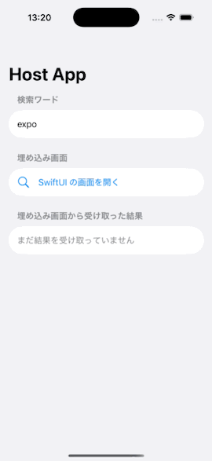 | 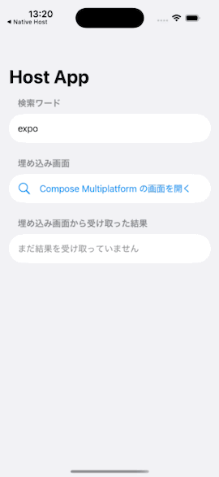 |  | 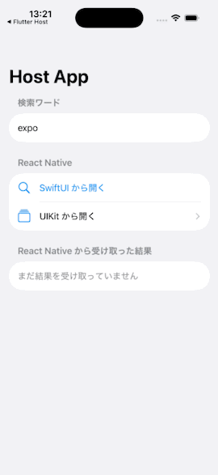 |
| Android |  |  |  |  |

録画は `node bench/demo.mjs` で撮り直せます（[bench/README.md](bench/README.md)）。

## 各実装の埋め込み方

| | iOS に持ち込む形 | Android に持ち込む形 | 画面のランタイム | ホスト ⇄ 画面 |
| --- | --- | --- | --- | --- |
| [native](native/README.md) | ローカル Swift Package | ライブラリモジュール | なし（SwiftUI / Compose） | Swift / Kotlin の値をそのまま |
| [kmp](kmp/README.md) | static XCFramework | AAR | Compose Multiplatform（iOS は Skia で自前描画、Android は Jetpack Compose そのもの） | Kotlin オブジェクト（iOS は Objective-C interop 越し） |
| [flutter](flutter/README.md) | xcframework（dynamic） | AAR | Flutter エンジン（起動時に 1 つ作って使い回す） | MethodChannel |
| [expo](expo/README.md) | Swift Package（xcframework 群） | AAR | React Native（Hermes、起動時に初期化） | expo-brownfield のメッセージ |

## 計測環境

すべての結果に共通です。

| | |
| --- | --- |
| Mac | MacBook Air（M3, 2024 / Mac15,12）、メモリ 16 GB、macOS 26.6.2 |
| iOS シミュレータ | Xcode 26.6、iPhone 17 シミュレータ（iOS 26.5） |
| Android エミュレータ | Android Emulator 37.1.11、AVD Pixel 9（API 36, Google APIs, arm64-v8a） |
| iOS 実機 | iPhone XR（A12 Bionic、iOS 18.7.10） |
| Android 実機 | Rakuten Hand 5G（Snapdragon 480 5G、Android 11） |
| ツール | agent-device 0.21.1、Node.js 24.13.0 |
| フレームワーク | Flutter 3.47.4、Kotlin 2.4.20 / Compose Multiplatform 1.12.0、Expo SDK 57（React Native 0.86.2） |

iPhone 17（iOS 27）は実機の計測に使えませんでした。Xcode 26.6 は iOS 27 用の開発用ディスクイメージを持たず、アプリを入れられないためです。
実機はどちらも数年前の機種で、開発機の上で動くシミュレータ / エミュレータより CPU が遅い点に注意してください。

## 計測条件

結果は、ビルドの種類と端末の組み合わせで 3 つあります。

| 結果 | ビルド | 端末 | 何のための計測か |
| --- | --- | --- | --- |
| [1. デバッグビルド](#1-デバッグビルド) | デバッグ | iOS シミュレータ / Android エミュレータ | 開発中（Xcode / Android Studio から動かすとき）の体感 |
| [2. リリースビルド](#2-リリースビルド) | リリース | iOS シミュレータ / Android エミュレータ | **フレームワーク間の比較の基準** |
| [3. 実機](#3-実機) | リリース | iPhone XR / Rakuten Hand 5G | シミュレータ / エミュレータの傾向が実機でも同じか |

ビルドの種類ごとの中身は次のとおりです。Expo はどちらもローカルでビルドしています（EAS は使わない）。

| | デバッグビルド | リリースビルド |
| --- | --- | --- |
| iOS のホストアプリ | Xcode の Debug 構成（最適化なし） | Release 構成 |
| Android のホストアプリ | debug ビルドタイプ（R8 なし、debuggable） | release ビルドタイプ（R8 有効、デバッグ鍵で署名） |
| native | 同じ Swift Package / ライブラリモジュールを Debug / debug でビルド | 同じものを Release / release でビルド |
| KMP / CMP | iOS: Kotlin/Native の debug フレームワーク。Android: リリースと同じ AAR（KMP の Android ライブラリは 1 バリアントのみ） | iOS: release フレームワーク。Android: AAR |
| Flutter | iOS / Android とも Debug（JIT） | Android: Release（AOT）。iOS 実機: Release（AOT）。**iOS シミュレータ: Debug（JIT）**（下記） |
| Expo | JS は Metro から読み込む（Android は `adb reverse tcp:8081`） | JS は成果物に同梱 |

**iOS シミュレータの Flutter は、リリースビルドでもデバッグ（JIT）の Flutter です。**
Flutter 3.47 のリリース / プロファイル用の `App.xcframework` はシミュレータ向けに Dart のコードを含まず、シミュレータでは動かせないためです
（ホストアプリはリリース構成。[flutter/README.md](flutter/README.md)）。iOS の Flutter のリリース（AOT）の値は [3. 実機](#3-実機) にあります。

どの結果も、次の条件は共通です。

- **操作**: [agent-device](https://github.com/callstack/agent-device) ですべて自動化する。1 回の計測は
  「コールド起動 → 埋め込み画面を開く → 検索 → ホストからキーワードを差し替える → 戻る → もう一度開く → 戻る」。
- **回数**: 各実装 5 回の中央値。インストール直後の 1 回（ウォームアップ）は除く。
- **時間**: agent-device の操作時間を含めないよう、アプリ内で出力するマーカー（`BENCH|<name>|<epochMs>`）の差で測る。
  iOS のコールドスタートはプロセスの開始（`p_starttime`）から数えるので、OS がプロセスを起こす時間も入ります。
- **メモリ**: agent-device の `perf memory sample`。iOS はプロセスの RSS、Android は PSS で、指標が違います。プラットフォームをまたいで比べないでください。
- **通信**: GitHub API の代わりに [bench/mock-server](bench/README.md) が固定の 20 件を返す。つなぎ方は、iOS シミュレータは Mac のループバック、
  Android（エミュレータ / 実機）は USB などの `adb reverse`、iPhone 実機は Mac の LAN のアドレス（Wi‑Fi 経由）です。
- **ランタイムの初期化**: Flutter と Expo は、埋め込みのランタイム（Flutter エンジン / React Native）をアプリ起動時に初期化します（[AGENTS.md](AGENTS.md)）。
  そのぶんはコールドスタートとホスト画面のメモリに入り、埋め込み画面を開く時間からは外れます。
- **アプリサイズ**: Android の APK はどれも 4 ABI（arm64-v8a / armeabi-v7a / x86 / x86_64）を含むユニバーサル APK です。ストアで ABI ごとに配信した場合の大きさではありません。

## 1. デバッグビルド

開発中に Xcode / Android Studio から動かすときの構成で、iOS シミュレータと Android エミュレータで計測したものです。

<!-- bench:results:debug:start -->

### iOS：iPhone 17 シミュレータ（iOS 26.5）

デバッグビルド。5 回の中央値（ウォームアップ 1 回を除く）。

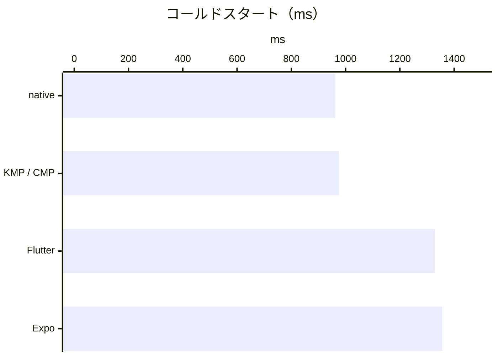

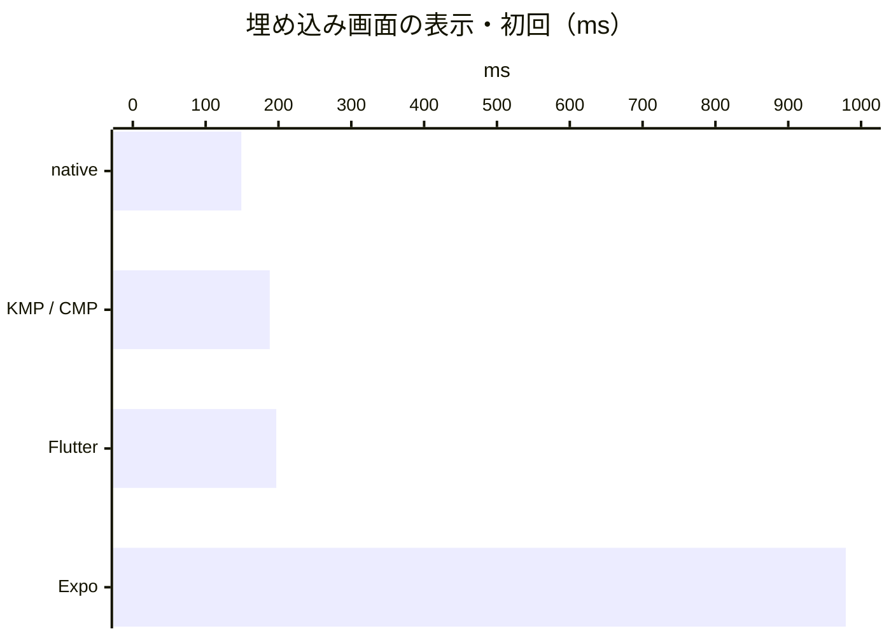

#### 時間

|  | native | KMP / CMP | Flutter | Expo |
| --- | ---: | ---: | ---: | ---: |
| コールドスタート（プロセス開始 → ホスト画面） | 962 ms | 975 ms | 1329 ms | 1356 ms |
| 埋め込み画面の表示（初回） | 149 ms | 188 ms | 197 ms | 979 ms |
| 埋め込み画面の表示（2 回目） | 42 ms | 86 ms | 76 ms | 65 ms |
| 検索 → 結果の描画 | 78 ms | 68 ms | 127 ms | 42 ms |
| 検索 → ホストが結果を受信 | 27 ms | 22 ms | 55 ms | 17 ms |
| ホスト → 埋め込み画面へのキーワード差し替え | 21 ms | 76 ms | 39 ms | 11 ms |

#### メモリ（RSS）

|  | native | KMP / CMP | Flutter | Expo |
| --- | ---: | ---: | ---: | ---: |
| ホスト画面の表示後 | 276.4 MB | 284.7 MB | 441.4 MB | 291.0 MB |
| 埋め込み画面の表示後 | 318.2 MB | 348.1 MB | 430.1 MB | 449.3 MB |
| 検索後 | 338.5 MB | 377.2 MB | 450.1 MB | 470.4 MB |
| ホストに戻った後 | 348.1 MB | 386.6 MB | 449.0 MB | 483.8 MB |

#### アプリサイズ

|  | native | KMP / CMP | Flutter | Expo |
| --- | ---: | ---: | ---: | ---: |
| .app（シミュレータ向け） | 1.6 MB | 51.4 MB | 140.1 MB | 171.8 MB |

### Android：Pixel 9 エミュレータ（API 36）

デバッグビルド。5 回の中央値（ウォームアップ 1 回を除く）。

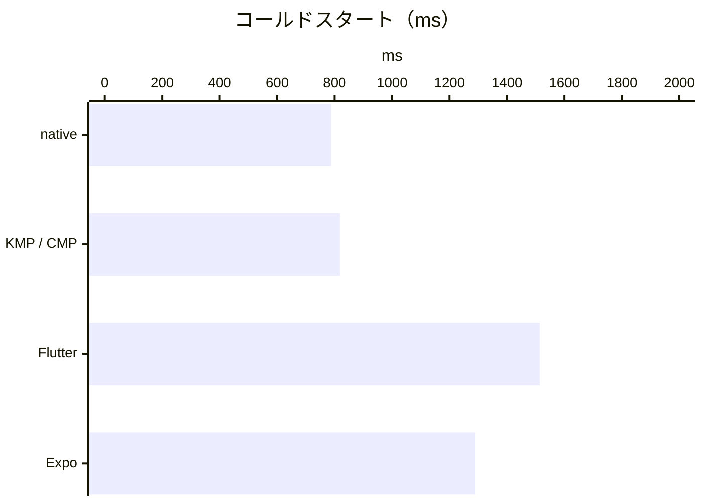

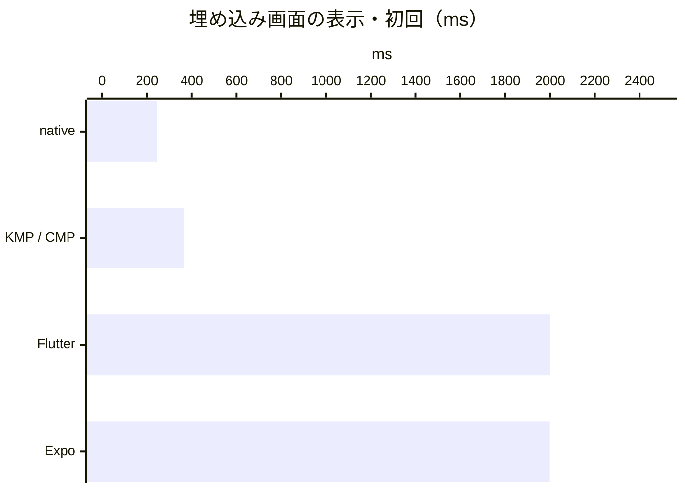

#### 時間

|  | native | KMP / CMP | Flutter | Expo |
| --- | ---: | ---: | ---: | ---: |
| コールドスタート（プロセス開始 → ホスト画面） | 788 ms | 819 ms | 1514 ms | 1288 ms |
| 埋め込み画面の表示（初回） | 244 ms | 368 ms | 2002 ms | 1999 ms |
| 埋め込み画面の表示（2 回目） | 244 ms | 265 ms | 234 ms | 125 ms |
| 検索 → 結果の描画 | 325 ms | 261 ms | 267 ms | 393 ms |
| 検索 → ホストが結果を受信 | 47 ms | 91 ms | 107 ms | 53 ms |
| ホスト → 埋め込み画面へのキーワード差し替え | 40 ms | 32 ms | 66 ms | 47 ms |

#### メモリ（PSS）

|  | native | KMP / CMP | Flutter | Expo |
| --- | ---: | ---: | ---: | ---: |
| ホスト画面の表示後 | 73.4 MB | 73.9 MB | 227.6 MB | 97.7 MB |
| 埋め込み画面の表示後 | 80.7 MB | 80.0 MB | 244.1 MB | 208.5 MB |
| 検索後 | 87.0 MB | 84.4 MB | 258.6 MB | 218.5 MB |
| ホストに戻った後 | 87.5 MB | 84.8 MB | 256.3 MB | 218.0 MB |

#### アプリサイズ

|  | native | KMP / CMP | Flutter | Expo |
| --- | ---: | ---: | ---: | ---: |
| APK | 11.4 MB | 13.1 MB | 152.6 MB | 132.5 MB |

<!-- bench:results:debug:end -->

### デバッグビルドの結果の読み方

- **Android のデバッグビルドは全体に遅く、メモリも多く使います。** debuggable なアプリは ART の事前コンパイル（ベースラインプロファイルなど）を使わず、
  インタプリタと JIT で動くためです。native でもコールドスタートが約 790 ms、検索 → 描画が約 330 ms かかります。
- その上に、**Flutter は Dart の JIT とデバッグ用のチェック、Expo は Metro から読む開発用の JS バンドル**が乗ります。
  Android ではコールドスタートが Flutter 約 1.5 秒・Expo 約 1.3 秒、埋め込み画面の初回表示がどちらも約 2 秒で、メモリは native の 2.5〜3 倍です。
- **iOS シミュレータのデバッグビルドは、リリースビルドとの差が小さく**なります（[2. リリースビルド](#2-リリースビルド) の「デバッグビルドからの変化」）。
  例外は Expo の埋め込み画面の初回表示（約 980 ms）で、Metro から読む開発用のバンドルと React Native の開発用の機能（LogBox など）のぶん長くなります。
- デバッグビルドの差は「開発中の体感」の目安です。フレームワークの性能の比較には [2. リリースビルド](#2-リリースビルド) を使ってください。

## 2. リリースビルド

アプリとして配布するときの構成で、iOS シミュレータと Android エミュレータで計測したものです。**フレームワーク間の比較の基準**にしています。
各プラットフォームの最後の表は、[1. デバッグビルド](#1-デバッグビルド) からリリースビルドにしたときの変化です。

<!-- bench:results:release:start -->

### iOS：iPhone 17 シミュレータ（iOS 26.5）

リリースビルド。5 回の中央値（ウォームアップ 1 回を除く）。

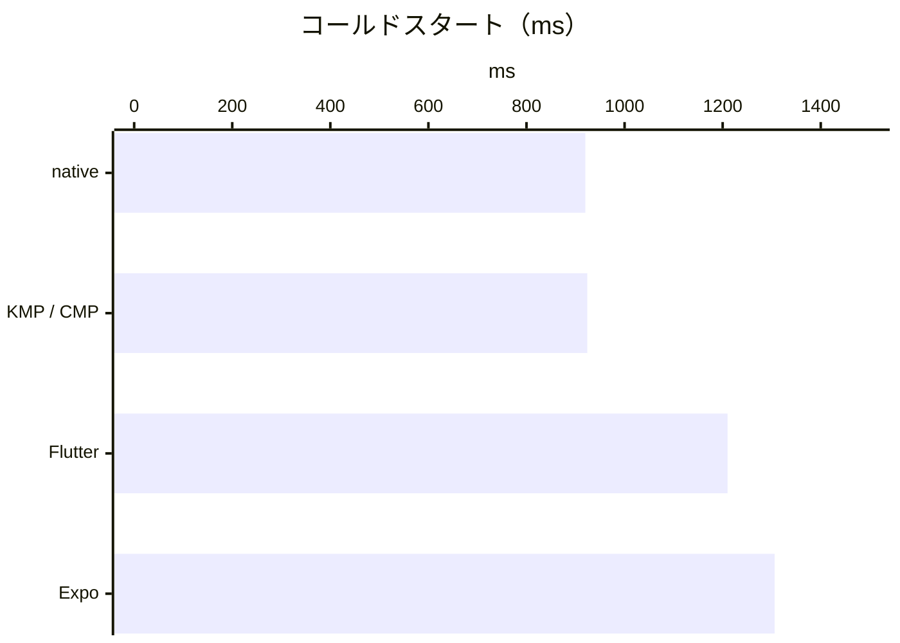

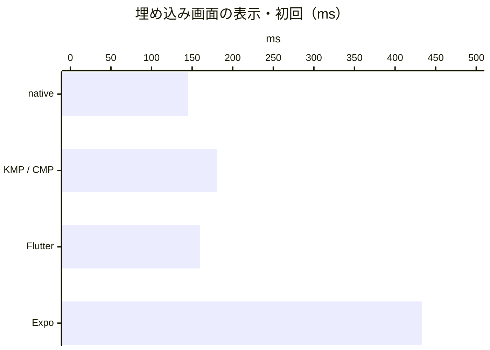

#### 時間

|  | native | KMP / CMP | Flutter | Expo |
| --- | ---: | ---: | ---: | ---: |
| コールドスタート（プロセス開始 → ホスト画面） | 920 ms | 924 ms | 1210 ms | 1306 ms |
| 埋め込み画面の表示（初回） | 145 ms | 181 ms | 160 ms | 433 ms |
| 埋め込み画面の表示（2 回目） | 44 ms | 82 ms | 58 ms | 48 ms |
| 検索 → 結果の描画 | 72 ms | 50 ms | 109 ms | 33 ms |
| 検索 → ホストが結果を受信 | 22 ms | 18 ms | 49 ms | 26 ms |
| ホスト → 埋め込み画面へのキーワード差し替え | 21 ms | 69 ms | 39 ms | 13 ms |

#### メモリ（RSS）

|  | native | KMP / CMP | Flutter | Expo |
| --- | ---: | ---: | ---: | ---: |
| ホスト画面の表示後 | 272.2 MB | 277.3 MB | 440.0 MB | 283.2 MB |
| 埋め込み画面の表示後 | 314.5 MB | 341.0 MB | 461.9 MB | 337.8 MB |
| 検索後 | 335.1 MB | 365.9 MB | 480.5 MB | 368.5 MB |
| ホストに戻った後 | 344.3 MB | 389.2 MB | 494.7 MB | 379.7 MB |

#### アプリサイズ

|  | native | KMP / CMP | Flutter | Expo |
| --- | ---: | ---: | ---: | ---: |
| .app（シミュレータ向け） | 1.0 MB | 32.4 MB | 139.8 MB | 52.5 MB |

#### デバッグビルドからの変化（デバッグ → リリース）

|  | native | KMP / CMP | Flutter | Expo |
| --- | ---: | ---: | ---: | ---: |
| コールドスタート（プロセス開始 → ホスト画面） | 962 ms → 920 ms | 975 ms → 924 ms | 1329 ms → 1210 ms | 1356 ms → 1306 ms |
| 埋め込み画面の表示（初回） | 149 ms → 145 ms | 188 ms → 181 ms | 197 ms → 160 ms | 979 ms → 433 ms |
| 埋め込み画面の表示（2 回目） | 42 ms → 44 ms | 86 ms → 82 ms | 76 ms → 58 ms | 65 ms → 48 ms |
| 検索 → 結果の描画 | 78 ms → 72 ms | 68 ms → 50 ms | 127 ms → 109 ms | 42 ms → 33 ms |
| 検索 → ホストが結果を受信 | 27 ms → 22 ms | 22 ms → 18 ms | 55 ms → 49 ms | 17 ms → 26 ms |
| ホスト → 埋め込み画面へのキーワード差し替え | 21 ms → 21 ms | 76 ms → 69 ms | 39 ms → 39 ms | 11 ms → 13 ms |
| メモリ（RSS、検索後） | 338.5 MB → 335.1 MB | 377.2 MB → 365.9 MB | 450.1 MB → 480.5 MB | 470.4 MB → 368.5 MB |
| アプリサイズ | 1.6 MB → 1.0 MB | 51.4 MB → 32.4 MB | 140.1 MB → 139.8 MB | 171.8 MB → 52.5 MB |

### Android：Pixel 9 エミュレータ（API 36）

リリースビルド。5 回の中央値（ウォームアップ 1 回を除く）。

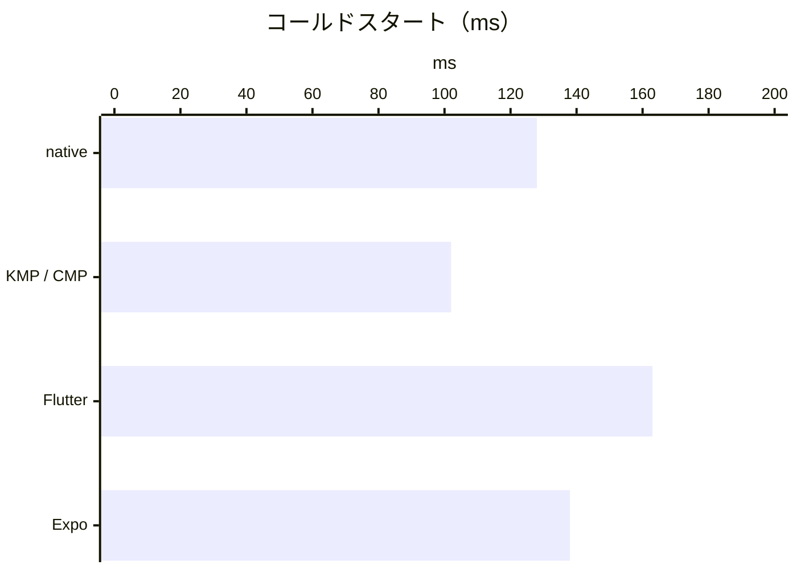

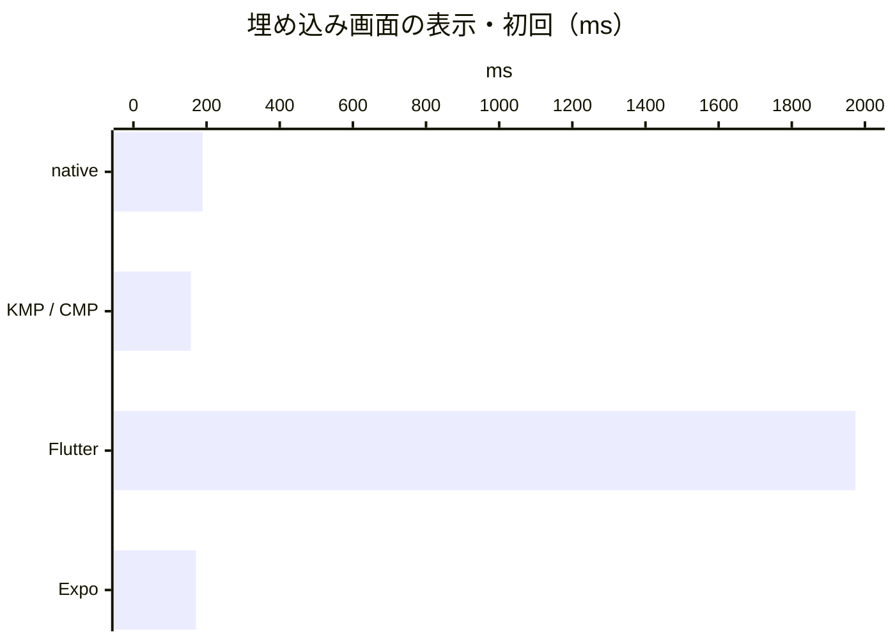

#### 時間

|  | native | KMP / CMP | Flutter | Expo |
| --- | ---: | ---: | ---: | ---: |
| コールドスタート（プロセス開始 → ホスト画面） | 128 ms | 102 ms | 163 ms | 138 ms |
| 埋め込み画面の表示（初回） | 189 ms | 157 ms | 1974 ms | 171 ms |
| 埋め込み画面の表示（2 回目） | 201 ms | 194 ms | 225 ms | 77 ms |
| 検索 → 結果の描画 | 66 ms | 64 ms | 35 ms | 73 ms |
| 検索 → ホストが結果を受信 | 7 ms | 11 ms | 6 ms | 38 ms |
| ホスト → 埋め込み画面へのキーワード差し替え | 23 ms | 28 ms | 24 ms | 17 ms |

#### メモリ（PSS）

|  | native | KMP / CMP | Flutter | Expo |
| --- | ---: | ---: | ---: | ---: |
| ホスト画面の表示後 | 21.1 MB | 21.5 MB | 55.7 MB | 32.6 MB |
| 埋め込み画面の表示後 | 25.8 MB | 26.4 MB | 64.7 MB | 52.2 MB |
| 検索後 | 28.5 MB | 29.4 MB | 69.8 MB | 68.9 MB |
| ホストに戻った後 | 28.9 MB | 29.7 MB | 69.8 MB | 68.2 MB |

#### アプリサイズ

|  | native | KMP / CMP | Flutter | Expo |
| --- | ---: | ---: | ---: | ---: |
| APK（R8 有効） | 1.2 MB | 1.5 MB | 44.4 MB | 56.6 MB |

#### デバッグビルドからの変化（デバッグ → リリース）

|  | native | KMP / CMP | Flutter | Expo |
| --- | ---: | ---: | ---: | ---: |
| コールドスタート（プロセス開始 → ホスト画面） | 788 ms → 128 ms | 819 ms → 102 ms | 1514 ms → 163 ms | 1288 ms → 138 ms |
| 埋め込み画面の表示（初回） | 244 ms → 189 ms | 368 ms → 157 ms | 2002 ms → 1974 ms | 1999 ms → 171 ms |
| 埋め込み画面の表示（2 回目） | 244 ms → 201 ms | 265 ms → 194 ms | 234 ms → 225 ms | 125 ms → 77 ms |
| 検索 → 結果の描画 | 325 ms → 66 ms | 261 ms → 64 ms | 267 ms → 35 ms | 393 ms → 73 ms |
| 検索 → ホストが結果を受信 | 47 ms → 7 ms | 91 ms → 11 ms | 107 ms → 6 ms | 53 ms → 38 ms |
| ホスト → 埋め込み画面へのキーワード差し替え | 40 ms → 23 ms | 32 ms → 28 ms | 66 ms → 24 ms | 47 ms → 17 ms |
| メモリ（PSS、検索後） | 87.0 MB → 28.5 MB | 84.4 MB → 29.4 MB | 258.6 MB → 69.8 MB | 218.5 MB → 68.9 MB |
| アプリサイズ | 11.4 MB → 1.2 MB | 13.1 MB → 1.5 MB | 152.6 MB → 44.4 MB | 132.5 MB → 56.6 MB |

<!-- bench:results:release:end -->

### リリースビルドの結果の読み方

- シミュレータ / エミュレータ上の数値です。実機の絶対値ではなく、同じ環境でのフレームワーク間の差として読んでください。

Android:

- **コールドスタート**は native / KMP / Expo が 100〜140 ms、Flutter が約 160 ms。起動時のエンジン初期化のぶん Flutter が遅くなっています。
- **Flutter の埋め込み画面の初回表示（約 2 秒）** が突出しています。エンジンは起動時に動かしていますが、
  初めて `FlutterFragment` を付けるときの描画面の用意はここに入ります。エミュレータの Flutter は Impeller を OpenGLES で動かしており、
  それがエミュレータでだけ大きく出ています（実機では約 200 ms。[3. 実機](#3-実機)）。2 回目は約 220 ms で他と同程度です。
- どのホストも埋め込み画面を表示ごとに新しい Activity で開きます。その中で Expo の 2 回目の表示（約 80 ms）が最も短く、
  React Native のランタイムと JS がすでに読み込まれていて、ルートビューを作るだけで済むためと考えられます。
- **検索 → ホストが結果を受信** は Expo が約 40 ms で、ほかの 3 つ（10 ms 前後）より長くなっています。
  20 件の結果を JS からネイティブへ渡すメッセージの変換のぶんです。
- **メモリ**は native と KMP がほぼ同じ（Android の KMP の画面は Jetpack Compose そのもの）です。
  Flutter は起動直後から約 35 MB、Expo は検索後に約 40 MB、native より多く使います。
- **デバッグビルドからの変化が大きい**のが Android です。コールドスタートは native で約 790 ms → 約 130 ms、
  検索 → 描画は約 330 ms → 約 70 ms、メモリ（PSS）は約 3 分の 1 になります。デバッグビルドの差はリリースの差とは大きく異なります。

iOS:

- **Flutter はデバッグ（JIT）の Flutter での値です**（[計測条件](#計測条件)）。コールドスタート・描画・メモリ・アプリサイズはリリースより不利に出ており、
  特にアプリサイズ（約 140 MB）とメモリ（native より約 170 MB 多い）はリリースの目安になりません。
  実機（iPhone XR）のリリース（AOT）では、アプリサイズは約 14 MB、メモリは native と同程度でした（[3. 実機](#3-実機)）。
- **コールドスタート**は native と KMP が約 920 ms で同じです。Flutter（約 1.2 秒）と Expo（約 1.3 秒）は、
  起動時にランタイムを初期化するぶん 300〜400 ms ほど長くなっています。
  シミュレータがプロセスを起こす時間も入るので、Android より大きく出ます。
- **Expo の埋め込み画面の初回表示（約 430 ms）** が最も長く、2 回目は約 50 ms です。
  初回は React Native のルートビューと JS のコンポーネントを初めて描くぶんが入ります。
- **KMP の 2 回目の表示（約 80 ms）とキーワード差し替え（約 70 ms）** は native の 2〜3 倍です。
  iOS の Compose Multiplatform は Skia で自前描画し、`ComposeUIViewController` を表示ごとに作ります。
- Flutter の 2 回目の表示は、ビューコントローラーを 1 つ使い回す構成です（アクセシビリティのための制約。[flutter/README.md](flutter/README.md)）。
  表示ごとに作り直す他の実装より少し有利です。
- **メモリ**は native・KMP・Expo がホスト画面で 270〜285 MB と近く、埋め込み画面を開いて検索すると
  KMP と Expo は native より 30〜35 MB 多くなります。iOS シミュレータの RSS はシミュレータのシステムフレームワークも含むので、native でも 270 MB ほどになります。
- **デバッグビルドからの変化は小さく**、native はどの指標も 1 割前後、KMP も検索 → 描画（約 70 ms → 約 50 ms）を除けば 1 割前後です
  （Mac の CPU で動くシミュレータでは、Swift の最適化の有無がこの程度の画面ではほとんど効きません）。
  大きく変わるのは Expo で、埋め込み画面の初回表示が約 980 ms → 約 430 ms、メモリ（検索後）が約 100 MB 減ります。

## 3. 実機

[2. リリースビルド](#2-リリースビルド) の傾向が実機でも同じかを、リリースビルドで確かめたものです。
端末は [計測環境](#計測環境) のとおり iPhone XR と Rakuten Hand 5G で、iPhone は実機向けに開発用の証明書で署名したビルド（**Flutter もリリース（AOT）**）、
Android はエミュレータと同じ APK です。各プラットフォームの最後の表は、シミュレータ / エミュレータから実機にしたときの変化です。

<!-- bench:results:release-device:start -->

### iOS：iPhone XR 実機（iOS 18.7）

リリースビルド。5 回の中央値（ウォームアップ 1 回を除く）。

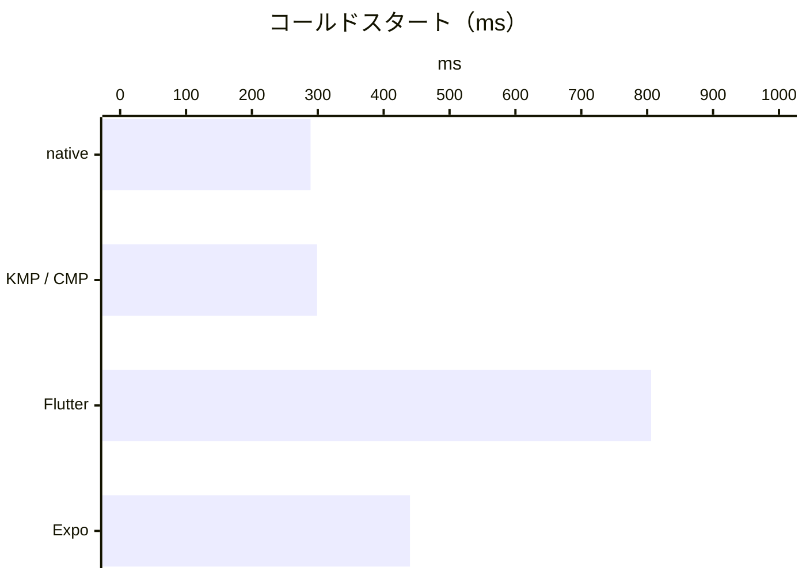

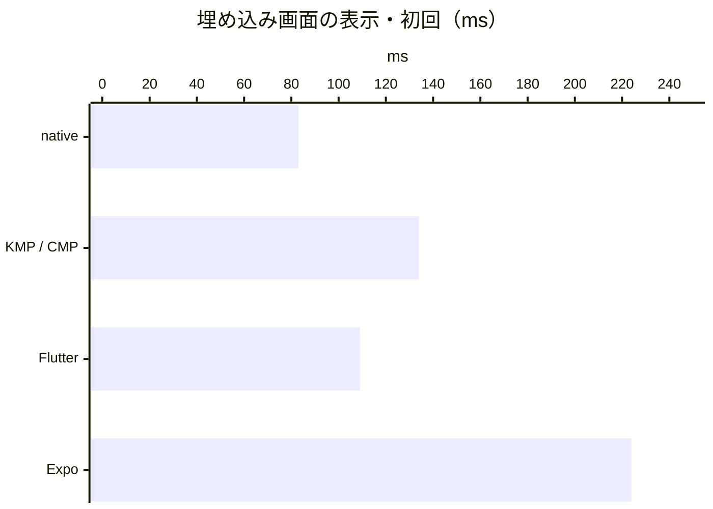

#### 時間

|  | native | KMP / CMP | Flutter | Expo |
| --- | ---: | ---: | ---: | ---: |
| コールドスタート（プロセス開始 → ホスト画面） | 289 ms | 299 ms | 806 ms | 440 ms |
| 埋め込み画面の表示（初回） | 83 ms | 134 ms | 109 ms | 224 ms |
| 埋め込み画面の表示（2 回目） | 63 ms | 71 ms | 64 ms | 76 ms |
| 検索 → 結果の描画 | 110 ms | 90 ms | 124 ms | 101 ms |
| 検索 → ホストが結果を受信 | 94 ms | 63 ms | 49 ms | 83 ms |
| ホスト → 埋め込み画面へのキーワード差し替え | 20 ms | 18 ms | 20 ms | 14 ms |

#### メモリ（RSS）

|  | native | KMP / CMP | Flutter | Expo |
| --- | ---: | ---: | ---: | ---: |
| ホスト画面の表示後 | 115.3 MB | 111.3 MB | 113.7 MB | 85.3 MB |
| 埋め込み画面の表示後 | 121.7 MB | 135.7 MB | 113.5 MB | 104.1 MB |
| 検索後 | 130.7 MB | 150.7 MB | 119.6 MB | 122.2 MB |
| ホストに戻った後 | 137.0 MB | 158.5 MB | 125.3 MB | 127.8 MB |

#### アプリサイズ

|  | native | KMP / CMP | Flutter | Expo |
| --- | ---: | ---: | ---: | ---: |
| .app（実機向け） | 0.6 MB | 32.4 MB | 14.1 MB | 27.1 MB |

#### シミュレータ / エミュレータからの変化（シミュレータ・エミュレータ → 実機）

|  | native | KMP / CMP | Flutter | Expo |
| --- | ---: | ---: | ---: | ---: |
| コールドスタート（プロセス開始 → ホスト画面） | 920 ms → 289 ms | 924 ms → 299 ms | 1210 ms → 806 ms | 1306 ms → 440 ms |
| 埋め込み画面の表示（初回） | 145 ms → 83 ms | 181 ms → 134 ms | 160 ms → 109 ms | 433 ms → 224 ms |
| 埋め込み画面の表示（2 回目） | 44 ms → 63 ms | 82 ms → 71 ms | 58 ms → 64 ms | 48 ms → 76 ms |
| 検索 → 結果の描画 | 72 ms → 110 ms | 50 ms → 90 ms | 109 ms → 124 ms | 33 ms → 101 ms |
| 検索 → ホストが結果を受信 | 22 ms → 94 ms | 18 ms → 63 ms | 49 ms → 49 ms | 26 ms → 83 ms |
| ホスト → 埋め込み画面へのキーワード差し替え | 21 ms → 20 ms | 69 ms → 18 ms | 39 ms → 20 ms | 13 ms → 14 ms |
| メモリ（RSS、検索後） | 335.1 MB → 130.7 MB | 365.9 MB → 150.7 MB | 480.5 MB → 119.6 MB | 368.5 MB → 122.2 MB |
| アプリサイズ | 1.0 MB → 0.6 MB | 32.4 MB → 32.4 MB | 139.8 MB → 14.1 MB | 52.5 MB → 27.1 MB |

### Android：Rakuten Hand 5G 実機（Android 11）

リリースビルド。5 回の中央値（ウォームアップ 1 回を除く）。

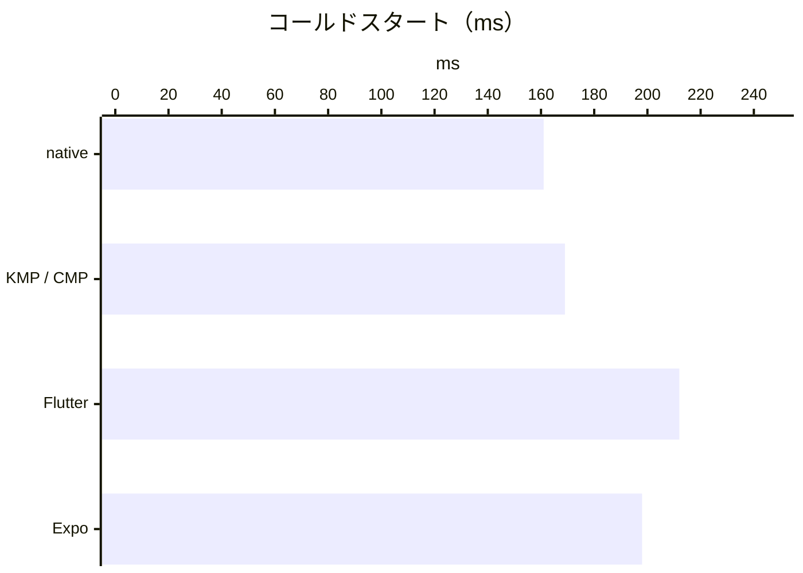

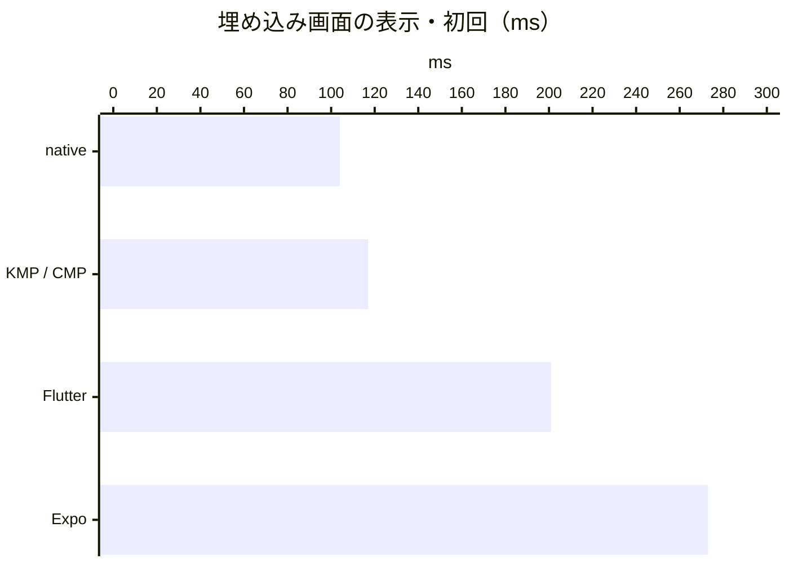

#### 時間

|  | native | KMP / CMP | Flutter | Expo |
| --- | ---: | ---: | ---: | ---: |
| コールドスタート（プロセス開始 → ホスト画面） | 161 ms | 169 ms | 212 ms | 198 ms |
| 埋め込み画面の表示（初回） | 104 ms | 117 ms | 201 ms | 273 ms |
| 埋め込み画面の表示（2 回目） | 103 ms | 108 ms | 95 ms | 71 ms |
| 検索 → 結果の描画 | 104 ms | 144 ms | 85 ms | 230 ms |
| 検索 → ホストが結果を受信 | 33 ms | 85 ms | 32 ms | 136 ms |
| ホスト → 埋め込み画面へのキーワード差し替え | 42 ms | 45 ms | 32 ms | 40 ms |

#### メモリ（PSS）

|  | native | KMP / CMP | Flutter | Expo |
| --- | ---: | ---: | ---: | ---: |
| ホスト画面の表示後 | 36.2 MB | 36.2 MB | 66.1 MB | 45.4 MB |
| 埋め込み画面の表示後 | 37.0 MB | 36.5 MB | 88.3 MB | 70.0 MB |
| 検索後 | 46.4 MB | 44.5 MB | 94.5 MB | 93.9 MB |
| ホストに戻った後 | 40.3 MB | 38.9 MB | 77.8 MB | 86.9 MB |

#### アプリサイズ

|  | native | KMP / CMP | Flutter | Expo |
| --- | ---: | ---: | ---: | ---: |
| APK（R8 有効） | 1.2 MB | 1.5 MB | 44.4 MB | 56.6 MB |

#### シミュレータ / エミュレータからの変化（シミュレータ・エミュレータ → 実機）

|  | native | KMP / CMP | Flutter | Expo |
| --- | ---: | ---: | ---: | ---: |
| コールドスタート（プロセス開始 → ホスト画面） | 128 ms → 161 ms | 102 ms → 169 ms | 163 ms → 212 ms | 138 ms → 198 ms |
| 埋め込み画面の表示（初回） | 189 ms → 104 ms | 157 ms → 117 ms | 1974 ms → 201 ms | 171 ms → 273 ms |
| 埋め込み画面の表示（2 回目） | 201 ms → 103 ms | 194 ms → 108 ms | 225 ms → 95 ms | 77 ms → 71 ms |
| 検索 → 結果の描画 | 66 ms → 104 ms | 64 ms → 144 ms | 35 ms → 85 ms | 73 ms → 230 ms |
| 検索 → ホストが結果を受信 | 7 ms → 33 ms | 11 ms → 85 ms | 6 ms → 32 ms | 38 ms → 136 ms |
| ホスト → 埋め込み画面へのキーワード差し替え | 23 ms → 42 ms | 28 ms → 45 ms | 24 ms → 32 ms | 17 ms → 40 ms |
| メモリ（PSS、検索後） | 28.5 MB → 46.4 MB | 29.4 MB → 44.5 MB | 69.8 MB → 94.5 MB | 68.9 MB → 93.9 MB |
| アプリサイズ | 1.2 MB → 1.2 MB | 1.5 MB → 1.5 MB | 44.4 MB → 44.4 MB | 56.6 MB → 56.6 MB |

<!-- bench:results:release-device:end -->

### 実機の結果の読み方

Android（Rakuten Hand 5G、Snapdragon 480 5G）:

- **エミュレータで突出していた Flutter の埋め込み画面の初回表示は、実機では約 200 ms** でした（エミュレータは約 2 秒）。
  エミュレータの Flutter は Impeller を OpenGLES で動かしており、初めて描画面を用意する処理がエミュレータでだけ重かったことになります。
  それでも native（約 100 ms）の 2 倍ほどです。
- 実機の CPU は開発機の上で動くエミュレータより遅いので、多くの値がエミュレータより大きくなります。
  特に **Expo** は、埋め込み画面の初回表示（約 270 ms）、検索 → 描画（約 230 ms）、検索 → ホストが受信（約 140 ms）が
  4 実装で最も長く、JS の実行やメッセージの変換の重さがエミュレータより目立ちます。
- **検索 → 描画は Flutter が最も短く**（約 85 ms）、native（約 100 ms）や KMP（約 140 ms）より速い傾向はエミュレータと同じです。
- **コールドスタート**は native と KMP が約 160〜170 ms、Flutter が約 210 ms、Expo が約 200 ms で、並びはエミュレータと同じです。
- **メモリ（PSS、検索後）** は native と KMP が約 45 MB、Flutter と Expo が約 94 MB で、どちらも native の約 2 倍です。

iOS（iPhone XR、A12 Bionic）:

- **Flutter をリリース（AOT）で計測できた唯一の iOS の結果です。** アプリサイズは約 14 MB（シミュレータのデバッグ版は約 140 MB）、
  メモリ（検索後）は約 120 MB で native（約 131 MB）と同程度でした。一方で **コールドスタートは約 810 ms** と 4 実装で最も長く、
  native（約 290 ms）より 500 ms ほど遅くなります。起動時に Flutter エンジンと Dart の isolate を立ち上げるぶんです。
- **Expo** はコールドスタートが約 440 ms（native より約 150 ms 長い）、**埋め込み画面の初回表示が約 220 ms** で 4 実装で最も長くなります。
  React Native のルートビューと JS のコンポーネントを初めて描くぶんで、2 回目の表示（約 76 ms）や検索、キーワード差し替えは native と大差ありません。
- **KMP** は埋め込み画面の初回表示が約 130 ms（native は約 80 ms）で、**メモリ（検索後）が約 151 MB と 4 実装で最も多い**です。
  Compose Multiplatform が Skia での描画に使うメモリのぶんと考えられます。
- 検索の 2 つの指標には、iPhone から Mac のモックサーバへの **Wi‑Fi の往復** が入ります（Android は USB 経由）。
  「検索 → ホストが受信」が 50〜95 ms とばらつくのはこのためで、Android との比較や細かな差の読み取りには向きません。
- 実機の RSS には、アプリが触れたシステムの共有ライブラリのページも入ります。起動直後の Expo（約 85 MB）が native（約 115 MB）より
  少ないなど、フレームワーク自体の大きさとは一致しない値もあるので、メモリの差は大まかな目安として読んでください。

## 計測をやり直す

手順は [run-benchmark スキル](.claude/skills/run-benchmark/SKILL.md) にまとめています。概略は次のとおりです。

```bash
cd bench
npm ci
npm run mock-server -- --quiet &
./scripts/build.sh <native|kmp|flutter|expo> <ios|android>   # 計測用ビルド
node run.mjs --platform ios --framework all --iterations 5
node run.mjs --platform android --framework all --iterations 5
node report.mjs --write
```

デバッグビルドは `./scripts/build.sh <framework> <platform> debug` で作り、Expo 用に Metro を起動してから
`node run.mjs --platform <ios|android> --framework all --build debug` で計測します。
実機は `--physical` を付けて計測します。端末の表示名は `--device-label` で渡せます（[bench/README.md](bench/README.md)）。
